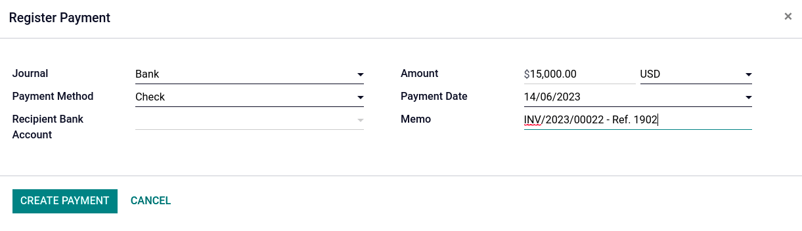

======
Checks
======

There are two ways to handle payments received by checks. Odoo support both approaches so that you
can use the one that better fits your habits.

#. **Outstanding accounts:** when you receive a check, you record a payment by check on the invoice.
   Then, when the check arrives in your bank account, you reconcile the payment and statement to
   move the money from the **Outstanding Receipt** account to your **Bank** account.

#. **One journal entry only:** when your receive a check, you record a payment on your bank, paid
   by check, without going through the **Undeposited Funds**. Once you process your bank
   reconciliation, you match it with your bank feed and the check payment, without creating a
   dedicated journal entry.

.. note::
   - We recommend the first approach as it is more accurate (your bank account balance is accurate,
     taking into accounts checks that have not been cashed yet).

.. seealso::
   :doc:`batch`

Outstanding account
===================

Configuration
-------------

By default, the payment methods for checks in Odoo are:

- **Manual**: for single checks;
- :doc:`Batch Deposit <batch>`: for multiple checks at once.

However, if you need a specific *Check* payment method, go to :menuselection:`Accounting -->
Configuration --> Journals --> Bank`, click the :guilabel:`Incoming Payments` tab, and
:guilabel:`Add a line`. As :guilabel:`Payment Method`, select :guilabel:`Manual`, enter `Checks` as
name, and :guilabel:`Save`.

Journal entry
-------------

Once you receive a customer check, go to the related invoice (:menuselection:`Accounting -->
Customer --> Invoices)`, and click on :guilabel:`Register Payment`. Fill in the payment information,
and click :guilabel:`Create Payment`.

- :guilabel:`Journal: Bank`;
- :guilabel:`Payment method: Manual` (or **Checks** if you have created a specific payment method);
- :guilabel:`Memo`: enter the check number.

The invoice is marked as :guilabel:`In Payment` as soon as you record the check. This operation
produces the following **journal entry**:

+----------------------+-------------------+----------+----------+
| Account              | Statement Match   | Debit    | Credit   |
+======================+===================+==========+==========+
| Account Receivable   |                   |          | 100.00   |
+----------------------+-------------------+----------+----------+
| Outstanding Receipts |                   | 100.00   |          |
+----------------------+-------------------+----------+----------+

Then, once you receive the bank statements, match this statement with the check of the **Outstanding
Receipts** account. This produces the following **journal entry**:

+---------------------+-------------------+----------+----------+
| Account             | Statement Match   | Debit    | Credit   |
+=====================+===================+==========+==========+
| Outstanding Receipts|        X          |          | 100.00   |
+---------------------+-------------------+----------+----------+
| Bank                |                   | 100.00   |          |
+---------------------+-------------------+----------+----------+

If you use this approach to manage received checks, you get the list of checks that have not been
cashed in the **Outstanding Receipt** account (accessible, for example, from the general ledger).

.. Note::
    Both methods will produce the same data in your accounting at the end of the process. But, if
    you have checks that have not been cashed in, this method will report uncashed checks on the
    **Outstanding Receipts** account. However, funds will appear in your bank account whether they
    are reconciled or not, as the bank value is reflected at the moment of the bank statement.

Only one journal entry
======================

Configuration
-------------

If you wish to have only **one** journal entry, go to :menuselection:`Accounting --> Configuration
--> Journals --> Bank`. Click `Add a line`, select :guilabel:`Manual` as :guilabel:`Payment Method`,
and enter `Checks` as :guilabel:`Name`. Click the :guilabel:`vertical ellipsis (⋮)` button, tick
:guilabel:`Outstanding Payments accounts`, and in the :guilabel:`Outstanding Receipts accounts`, set
the :guilabel:`Bank` account for the **Check** payment method, and :guilabel:`Save`.

Journal entry
-------------

Once you receive a customer check, go to the related invoice (:menuselection:`Accounting -->
Customer --> Invoices)`, and click on :guilabel:`Register Payment`. Fill in the payment information,
and click :guilabel:`Create Payment`.

- :guilabel:`Journal: Bank`;
- :guilabel:`Payment method: Manual` (or **Checks** if you have created a specific payment method);
- :guilabel:`Memo`: enter the check number.

The invoice is marked as :guilabel:`Paid` as soon as you record the check.

With this approach, you bypass the use of **outstanding accounts**, effectively getting only one
journal entry in your books:

+----------------------+-------------------+----------+----------+
| Account              | Statement Match   | Debit    | Credit   |
+======================+===================+==========+==========+
| Account Receivable   | X                 |          | 100.00   |
+----------------------+-------------------+----------+----------+
| Bank                 |                   | 100.00   |          |
+----------------------+-------------------+----------+----------+
